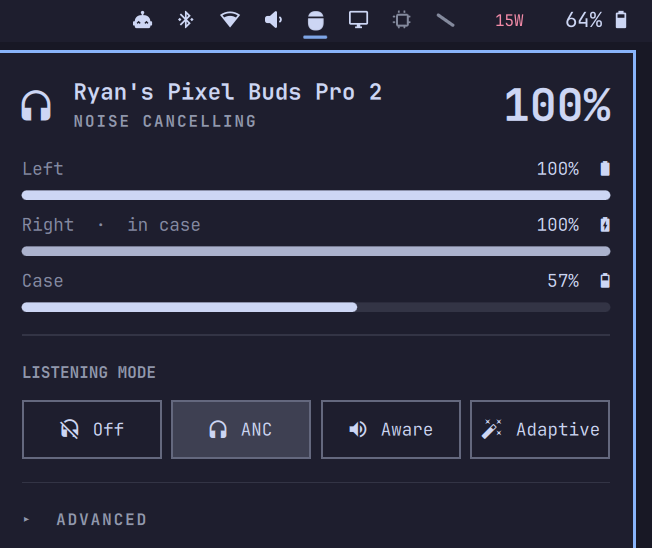

# Pixel Buds for Omarchy

Pixel Buds battery and listening-mode control, right in the Omarchy bar.



## Features

- **Per-bud and case battery** with charging and in-case state. The case only
  reports while a bud is docked (it has no radio of its own), so the last
  reading is cached and shown with a "last seen" age — same trick Android uses.
- **Listening-mode panel**: Off / Noise Cancelling / Transparency / Adaptive,
  clickable or keyboard-navigable.
- **Quick ANC cycling**: right- or middle-click the bar icon to cycle modes
  without opening the panel.
- **Device toggles**: multipoint audio, speech detection (auto-transparency
  while you talk), on-head detection, and volume level alerts. Rows are
  capability-gated — a control only appears if your buds answer for it.
- **Advanced sound**, tucked behind a collapsed section: volume-dependent EQ,
  mono audio, balance, and the 5-band EQ.
- **Low battery** turns a battery row the urgent color at 20% or less.
- **Event-driven**: subscribes to BlueZ D-Bus signals via `gdbus`, so the icon
  appears within about a second of the buds connecting — and while they're
  disconnected the plugin polls nothing at all.

The bar icon is the closed charging case, drawn to the proportions of the real
thing.

## Requirements

- the `pbpctrl` package from the AUR. If your Pixel Buds connect while it is
  missing, the bar icon shows in the urgent color and the popup explains,
  showing the install command with a button that copies it to your clipboard
  — paste it into a terminal to install. The plugin itself never installs
  software and never elevates privileges.
- BlueZ (`bluetoothctl`) and glib2 (`gdbus`) — both ship with Omarchy.
- `python3` (ships with Omarchy) for the small race-free case-battery cache
  helper; without it that one feature is simply skipped.
- Pixel Buds supported by `pbpctrl` (Pixel Buds Pro generation).

## Install

```bash
omarchy plugin add https://github.com/rdoupe/omarchy-pixelbuds.git --enable
```

## Remove

```bash
omarchy plugin remove io.github.rdoupe.pixelbuds
```

The only file written outside the plugin directory is the cached case-battery
reading at `${XDG_STATE_HOME:-~/.local/state}/omarchy-pixelbuds/case`, which
you can delete freely.

## Settings

| Setting | Default | Meaning |
|---------|---------|---------|
| `pollIntervalSec` | 30 | Battery/ANC poll interval while connected (the panel polls faster while open) |
| `hideWhenDisconnected` | true | Hide the bar icon entirely while no Pixel Buds are connected; set false to keep a dimmed icon |

Configure via the bar widget settings or directly in
`~/.config/omarchy/shell.json`.

## IPC

The widget exposes the IPC target `io.github.rdoupe.pixelbuds` with methods `open`,
`close`, `toggle`, `showAdvanced`, `refresh`, `cycleAnc`, and `setAnc(mode)` where mode is one
of `off`, `active`, `aware`, `adaptive`:

```bash
omarchy-shell io.github.rdoupe.pixelbuds cycleAnc
omarchy-shell io.github.rdoupe.pixelbuds setAnc aware
```

Handy for keybindings.

## How it works

`status.sh` first does a cheap `bluetoothctl` check for a connected pair; only
then does it talk to the buds over RFCOMM via `pbpctrl` for battery, placement,
and ANC state. Connect/disconnect detection is event-driven: a `gdbus` signal
subscription on `org.bluez` triggers a refresh the moment any device's
`Connected` state flips, with a short follow-up pass once the buds' RFCOMM
channel settles.

## License

[MIT](LICENSE)
